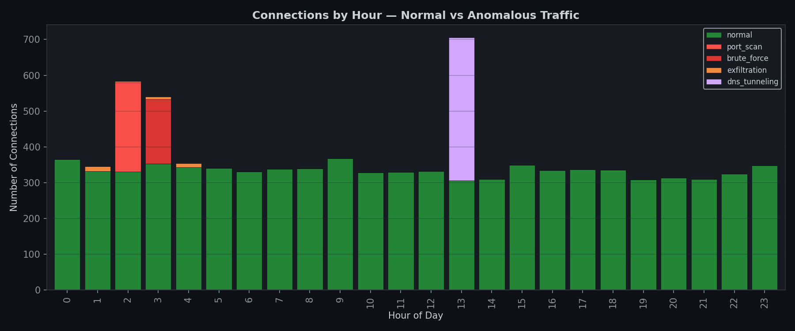
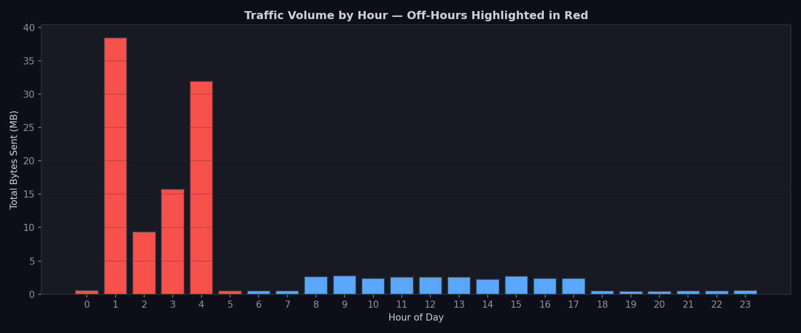
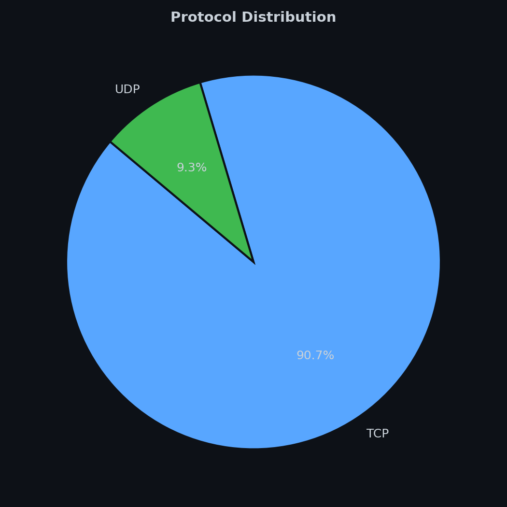
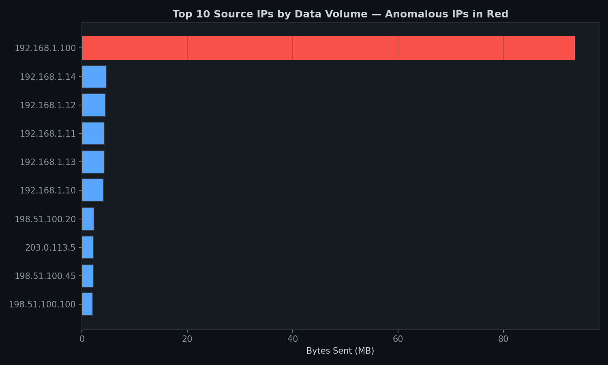
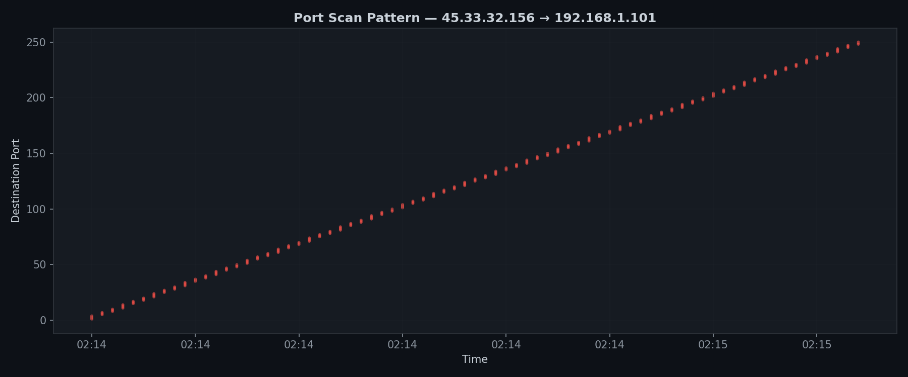
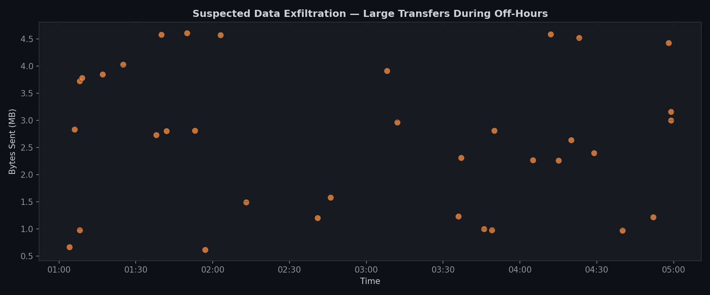

# 🔐 Network Traffic Analysis with Python
### `[Foundational]` — Cybersecurity & Data Analytics

<p align="center">
  
</p>

---

## 📋 Overview

This project simulates and analyzes 24 hours of network traffic from a **small local government unit (LGU) office network** in the Philippines. The dataset contains **8,865 connections** — including **865 deliberately embedded security anomalies** — designed to mirror threats commonly faced by under-resourced public-sector networks.

The analysis script detects four types of threats, visualizes traffic patterns, and produces actionable recommendations — the kind of output a junior SOC analyst or IT security officer would generate during an incident triage.

**Why an LGU scenario?** Local government units in the Philippines often lack dedicated cybersecurity staff. As a former City Attorney who worked alongside IT departments on procurement and infrastructure, I built this project around a context I understand firsthand — where one compromised workstation can expose citizen records, procurement data, and legal documents.

---

## 🎯 Objectives

- Parse and explore real-format network traffic logs using **Pandas**
- Implement **rule-based anomaly detection** for four common attack patterns
- Produce **six publication-quality visualizations** using Matplotlib
- Write **actionable security recommendations** based on findings
- Demonstrate structured, documented, and reproducible analysis

---

## 🧪 Threat Scenarios (Embedded in Data)

| # | Threat Type | Description | Records |
|---|---|---|---|
| 1 | **Port Scanning** | External IP `45.33.32.156` scans 250 ports on the internal web server | 250 |
| 2 | **SSH Brute Force** | Same attacker attempts 180 SSH logins against the IT workstation | 180 |
| 3 | **Data Exfiltration** | File server sends 93.5 MB to an external IP between 1–4 AM | 35 |
| 4 | **DNS Tunneling** | Finance workstation makes 400 rapid DNS queries (up to 75/min) | 400 |

All anomalies are labeled in the dataset (`label` column), enabling both detection validation and supervised learning experiments.

---

## 🏗️ Network Topology (Simulated)

```
                         ┌──────────────┐
                         │   INTERNET   │
                         └──────┬───────┘
                                │
                         ┌──────┴───────┐
                         │   Firewall   │
                         └──────┬───────┘
                                │
               ┌────────────────┼────────────────┐
               │                │                │
        ┌──────┴─────┐  ┌──────┴─────┐  ┌──────┴──────┐
        │  Web Server │  │ File Server│  │  DNS Server  │
        │ .1.101      │  │ .1.100     │  │ .1.200       │
        └─────────────┘  └────────────┘  └──────────────┘
               │
    ┌──────────┼──────────┬──────────┬──────────┐
    │          │          │          │          │
 ┌──┴──┐   ┌──┴──┐   ┌──┴──┐   ┌──┴──┐   ┌──┴──┐
 │Admin│   │Legal│   │Fin. │   │ IT  │   │Rec. │
 │ .10 │   │ .11 │   │ .12 │   │ .13 │   │ .14 │
 └─────┘   └─────┘   └─────┘   └─────┘   └─────┘
```

---

## 📊 Visualizations

### 1. Traffic Volume by Hour
Off-hours traffic (highlighted in red) reveals abnormal data movement when the office should be idle.



### 2. Protocol Distribution
Baseline protocol mix across all connections.



### 3. Top Talkers by Data Volume
The file server and attacker IP dominate outbound traffic — both flagged in red.



### 4. Port Scan Pattern
Sequential port enumeration from `45.33.32.156` — a textbook SYN scan signature.



### 5. Exfiltration Timeline
Large outbound transfers from the file server clustered between 1–4 AM.



### 6. Anomaly Breakdown by Hour
Normal vs. anomalous traffic distribution reveals concentrated attack windows.


---

## 🔍 Key Findings

```
ANOMALY DETECTION RESULTS
═══════════════════════════════════════════════════════════════════

  [1] PORT SCANNING
      ⚠  45.33.32.156  →  250 unique ports (hour 02:00)

  [2] BRUTE-FORCE SSH ATTEMPTS
      ⚠  45.33.32.156  →  180 SSH attempts (hour 03:00)

  [3] DATA EXFILTRATION (off-hours large transfers)
      ⚠  35 suspicious transfers detected
         Source(s)     : 192.168.1.100 (File Server)
         Destination(s): 91.198.174.50
         Total bytes   : 93,459,780 (93.5 MB)

  [4] DNS TUNNELING
      ⚠  Suspicious DNS activity from: 192.168.1.12 (Finance)
         Peak query rate: 75 queries/min
```

---

## ✅ Recommendations

| Priority | Action | Rationale |
|---|---|---|
| 🔴 Critical | Block `45.33.32.156` at the perimeter firewall | Confirmed scanning and brute-force source |
| 🔴 Critical | Investigate file server outbound traffic to `91.198.174.50` | 93.5 MB transferred during off-hours — potential data breach |
| 🟡 High | Enforce SSH key-based auth; disable password login | 180 brute-force attempts in one hour |
| 🟡 High | Audit DNS queries from Finance workstation (192.168.1.12) | Query rate consistent with DNS tunneling exfiltration |
| 🟢 Medium | Deploy network segmentation for file server | Prevent lateral movement and restrict outbound access |
| 🟢 Medium | Implement SIEM alerting for threshold-based anomalies | Enable real-time detection of the patterns found here |

---

## ⚙️ How to Run

```bash
# Clone the repository
git clone https://github.com/[your-username]/cyber-govtech-portfolio.git
cd cyber-govtech-portfolio/01-network-traffic-analysis

# Install dependencies
pip install -r requirements.txt

# Generate the synthetic dataset
python generate_traffic.py

# Run the analysis
python analyze_traffic.py
```

**Output:**
- Console: detection results and recommendations
- `output/`: six PNG chart files

---

## 📁 Project Structure

```
01-network-traffic-analysis/
├── README.md
├── requirements.txt
├── generate_traffic.py        # Synthetic data generator (8,865 records)
├── analyze_traffic.py         # Detection engine + visualisation
├── data/
│   └── network_traffic.csv    # Generated dataset
└── output/
    ├── 01_traffic_by_hour.png
    ├── 02_protocol_distribution.png
    ├── 03_top_talkers.png
    ├── 04_port_scan_scatter.png
    ├── 05_exfiltration_timeline.png
    └── 06_anomaly_breakdown.png
```

---

## 🧠 Skills Demonstrated

- **Python**: Pandas, Matplotlib, CSV, datetime
- **Cybersecurity concepts**: port scanning, brute force, exfiltration, DNS tunneling
- **Data analysis**: grouping, aggregation, threshold-based detection
- **Visualisation**: dark-themed publication-quality charts
- **Documentation**: structured README, reproducible workflow
- **Domain knowledge**: public-sector network context, LGU governance

---

## 🔮 Future Improvements

- [ ] Add machine learning–based anomaly detection (Isolation Forest, DBSCAN)
- [ ] Integrate with Wireshark `.pcap` files using Scapy
- [ ] Build an interactive dashboard with Streamlit or Plotly Dash
- [ ] Map findings to **MITRE ATT&CK** framework techniques
- [ ] Add GeoIP lookup for external IP attribution

---

## 📜 License

This project is for educational and portfolio purposes. The network traffic data is entirely synthetic — no real network data is used.

---

*Part of the [Cybersecurity & Data Analytics Portfolio](https://github.com/[your-username]/cyber-govtech-portfolio) — built to demonstrate technical capability to NZ-based tech employers.*
