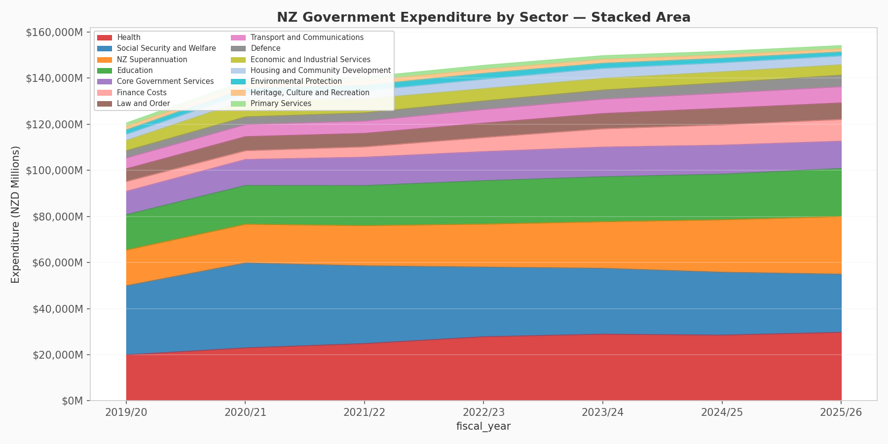
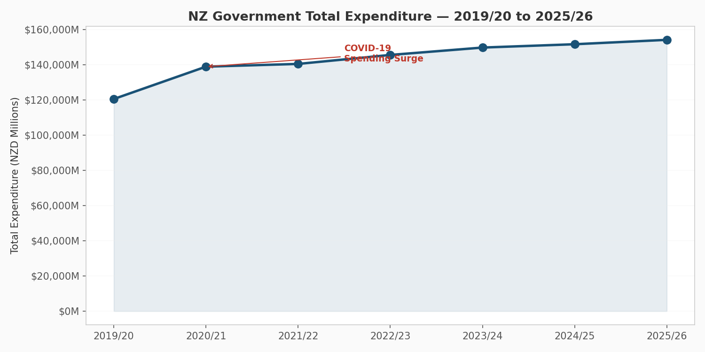
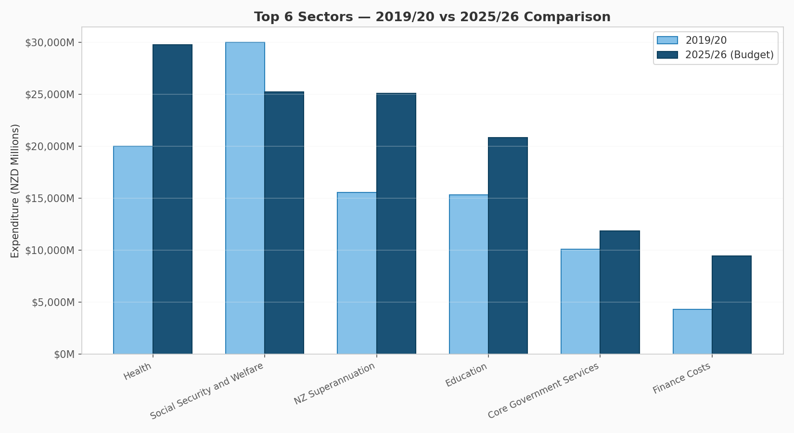
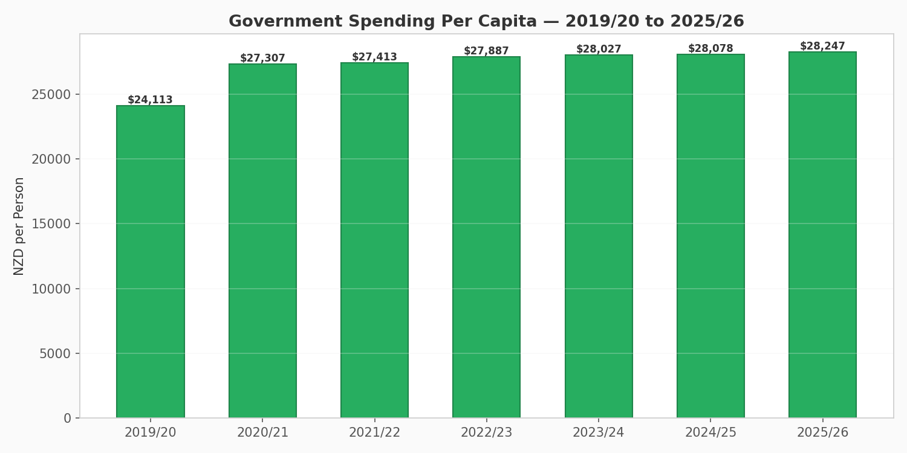
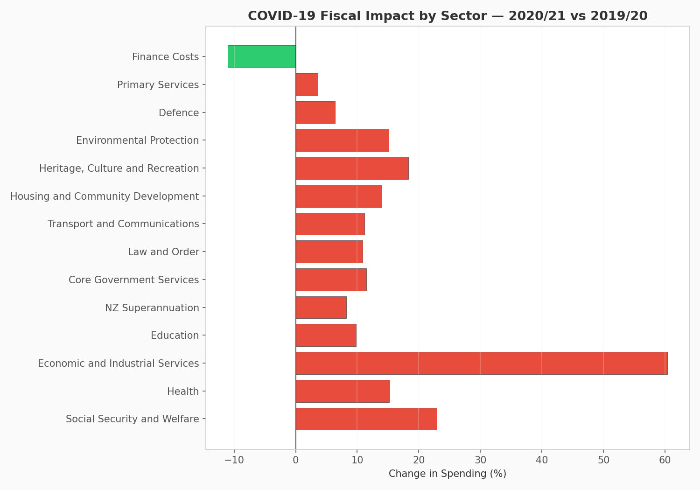
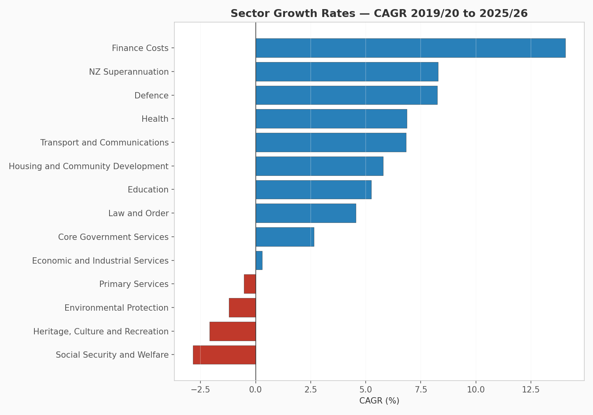
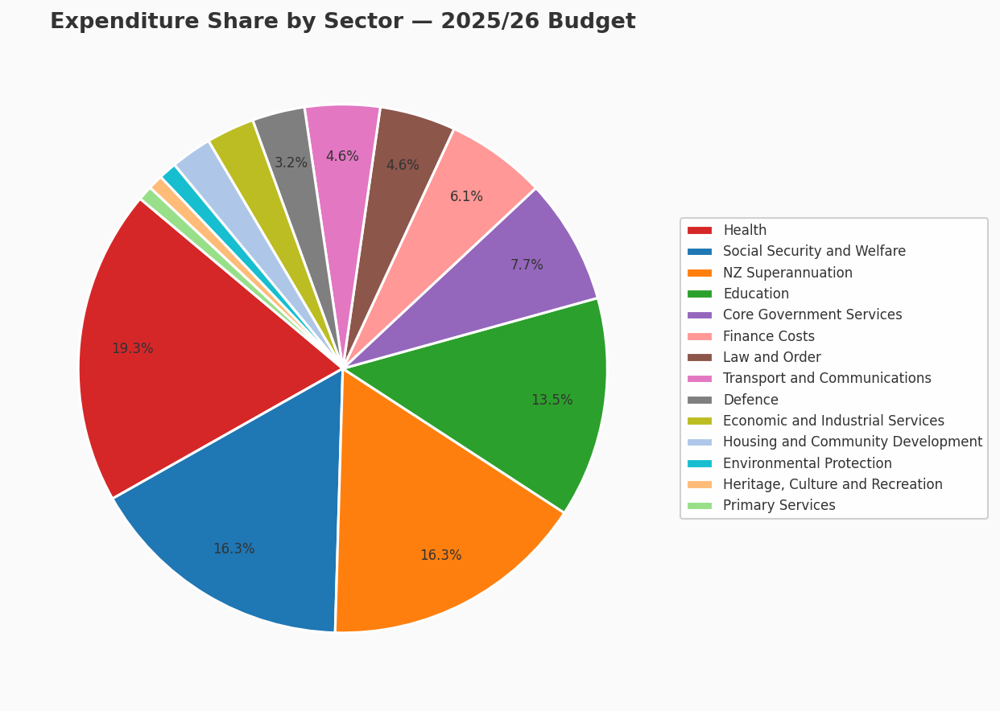
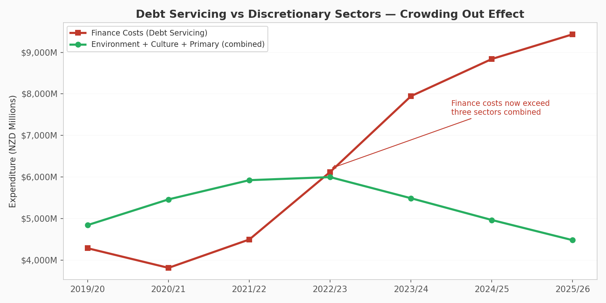

# 📊 NZ Government Spending Analysis — Budget Trends 2019–2026
### `[Intermediate]` — Data Analytics & Public Policy

<p align="center">
  
</p>

---

## 📋 Overview

This project analyzes **New Zealand government expenditure across 14 sectors** from fiscal year 2019/20 through 2025/26 — spanning the pre-COVID baseline, the pandemic spending surge, and the current period of fiscal consolidation under the National-led coalition government.

The analysis produces **five key findings** and **eight publication-quality charts**, modeled on the type of briefing material a Treasury analyst or Select Committee advisor would prepare for policymakers.

**Why NZ government spending?** As someone studying Contemporary International Studies in New Zealand and comparing governance systems across the Pacific, this project demonstrates that I can work with real public finance structures — Votes, appropriations, sector classifications — and extract policy-relevant insights, not just technical outputs.

---

## 🎯 Objectives

- Build a structured expenditure dataset modeled on NZ Treasury Estimates of Appropriations
- Perform **year-over-year**, **per-capita**, and **compound growth rate (CAGR)** analysis
- Quantify the **fiscal impact of COVID-19** across government sectors
- Identify **structural spending pressures** (superannuation, debt servicing)
- Visualize the **crowding-out effect** of finance costs on discretionary sectors
- Produce analyst-grade charts suitable for policy briefings

---

## 📁 Data Sources

The dataset is **synthetic but calibrated to real published figures** from:

| Source | Detail |
|---|---|
| [NZ Treasury — Budget 2025](https://www.treasury.govt.nz/publications/budgets/budget-2025) | Estimates of Appropriations, sector totals |
| [Budget at a Glance 2025](https://budget.govt.nz) | High-level expenditure by functional classification |
| [Financial Statements of the Government (June 2025)](https://www.treasury.govt.nz/publications/year-end/financial-statements-2025) | Actual expenditure for completed fiscal years |
| [Stats NZ — Population Estimates](https://www.stats.govt.nz) | Estimated resident population for per-capita calculations |

> The raw Treasury XLSX files require manual download and are not redistributable. This project generates a structured CSV calibrated to published totals, demonstrating data engineering alongside analysis.

---

## 📊 Visualizations

### 1. Total Expenditure Trend
Government spending grew from $121B to $154B over six years, with the COVID-19 spike clearly visible in 2020/21.



### 2. Expenditure by Sector — Stacked Area
The compositional shift is visible: social security contracts, superannuation and health expand, finance costs grow from a sliver to a significant wedge.


### 3. Top 6 Sectors — 2019/20 vs 2025/26
Side-by-side comparison reveals which sectors grew and which shrank over the period.



### 4. Per-Capita Spending
Government spending per person rose from $24,113 to $28,247 — a 17% increase over six years.



### 5. COVID-19 Fiscal Impact
Economic and Industrial Services saw the largest proportional surge (+60%), reflecting business support schemes. Social Security and Welfare saw the largest absolute increase (+$6.9B).



### 6. Sector Growth Rates (CAGR)
Finance costs are the fastest-growing category at 14.1% per annum — more than double any service-delivery sector.



### 7. Expenditure Share — 2025/26 Budget
Health and NZ Superannuation together consume over a third of total spending.



### 8. Crowding Out — Debt Servicing vs Discretionary Sectors
Finance costs now exceed the combined budgets of Environmental Protection, Heritage/Culture, and Primary Services — a crossover that occurred in 2022/23.



---

## 🔍 Key Findings

```
KEY OBSERVATIONS
══════════════════════════════════════════════════════════════════

  1. SUPERANNUATION IS THE FASTEST-GROWING OBLIGATION
     NZ Super grows at ~8.3% CAGR, driven by demographics — not
     policy. It will overtake Social Security and Welfare as the
     largest single line item by 2025/26.

  2. COVID-19 CREATED A FISCAL CLIFF IN SOCIAL SPENDING
     Social Security surged 22.9% in 2020/21 (wage subsidies,
     income relief) then declined sharply as emergency measures
     expired. The sector is now below pre-COVID baseline.

  3. HEALTH SPENDING GREW STEADILY THROUGH ALL ADMINISTRATIONS
     Unlike other sectors, health has increased every single year.

  4. FINANCE COSTS ARE CROWDING OUT DISCRETIONARY SPENDING
     Government borrowing costs grew from $4.2B to $9.5B — a 126%
     increase. Every dollar on debt servicing is unavailable for
     frontline services.

  5. ENVIRONMENTAL AND CULTURAL BUDGETS FACE CUTS
     These are the only sectors with negative CAGR — suggesting
     deprioritisation under current fiscal consolidation.
```

---

## 🏛️ Policy Relevance

This analysis demonstrates patterns familiar to anyone working in public finance — in New Zealand, the Philippines, or anywhere governments face the same structural pressures:

- **Demographic lock-in**: Superannuation commitments grow regardless of political will
- **Post-crisis fiscal drag**: Emergency spending creates expectations that are politically difficult to unwind
- **Crowding out**: Rising debt costs reduce fiscal space for discretionary investment
- **Prioritisation signals**: Where governments cut reveals what they value least

For Philippine policymakers, the NZ experience offers a useful benchmark — particularly around fiscal transparency (NZ publishes line-item data as downloadable spreadsheets) and the structural relationship between aging populations and public spending.

---

## ⚙️ How to Run

```bash
# Clone the repository
git clone https://github.com/[your-username]/cyber-govtech-portfolio.git
cd cyber-govtech-portfolio/02-nz-govt-spending-analysis

# Install dependencies
pip install -r requirements.txt

# Generate the dataset
python generate_nz_budget_data.py

# Run the analysis
python analyze_nz_spending.py
```

**Output:**
- Console: full summary statistics, year-over-year breakdown, key findings
- `output/`: eight PNG chart files

---

## 📁 Project Structure

```
02-nz-govt-spending-analysis/
├── README.md
├── requirements.txt
├── generate_nz_budget_data.py      # Data generator (245 records, 14 sectors)
├── analyze_nz_spending.py          # Analysis engine + 8 charts
├── data/
│   ├── nz_govt_expenditure.csv     # Main dataset
│   └── nz_population.csv           # Population reference
└── output/
    ├── 01_total_expenditure_trend.png
    ├── 02_sector_stacked_area.png
    ├── 03_top_sectors_comparison.png
    ├── 04_per_capita_spending.png
    ├── 05_covid_impact.png
    ├── 06_sector_cagr.png
    ├── 07_sector_share_pie.png
    └── 08_crowding_out.png
```

---

## 🧠 Skills Demonstrated

- **Python**: Pandas (groupby, pivot, merge), Matplotlib, NumPy
- **Data analysis**: YoY growth, CAGR, per-capita normalization, share analysis
- **Public finance literacy**: Votes, appropriations, fiscal year conventions, COFOG-style sector classification
- **Data engineering**: Structured dataset generation from published reference figures
- **Policy communication**: Findings written for decision-makers, not just technicians
- **Visualisation**: Eight analyst-grade charts with annotations and clear narratives

---

## 🔮 Future Improvements

- [ ] Download and integrate actual Treasury XLSX data for validation
- [ ] Add revenue-side analysis (tax composition, fiscal balance)
- [ ] Build interactive Streamlit dashboard with sector drill-down
- [ ] Compare NZ spending profile with Philippines, Australia, and OECD averages
- [ ] Add inflation-adjusted (real) spending calculations using RBNZ CPI data
- [ ] Map appropriations to UN Sustainable Development Goals (SDGs)

---

## 📜 License

This project is for educational and portfolio purposes. The dataset is synthetic, modeled on publicly available NZ Treasury budget figures. No proprietary government data is redistributed.

---

*Part of the [Cybersecurity & Data Analytics Portfolio](https://github.com/[your-username]/cyber-govtech-portfolio) — built to demonstrate technical capability to NZ-based tech employers.*
