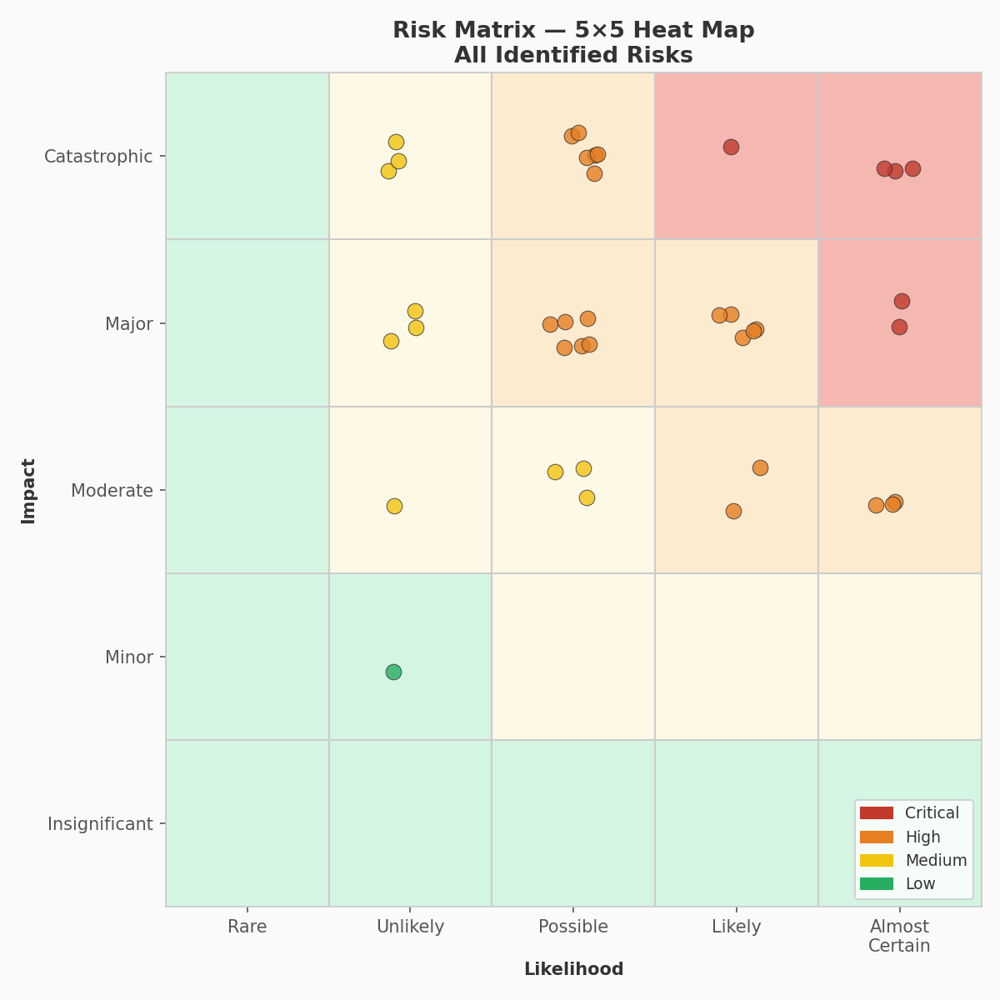
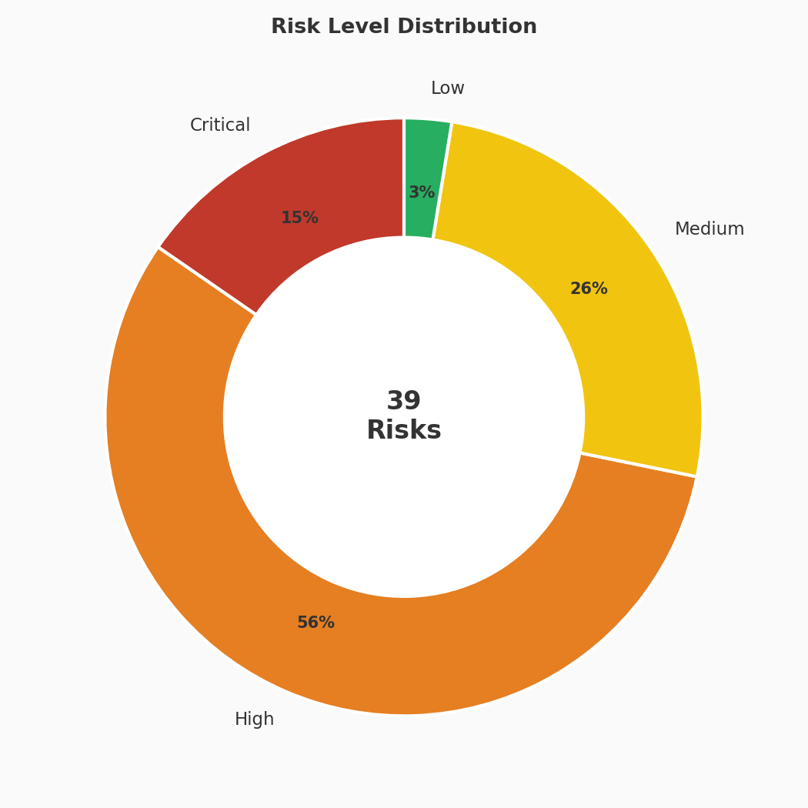
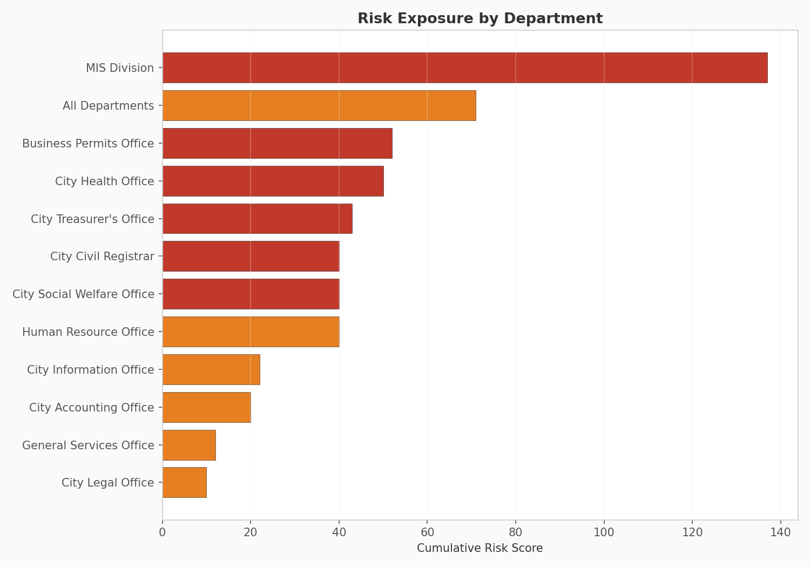
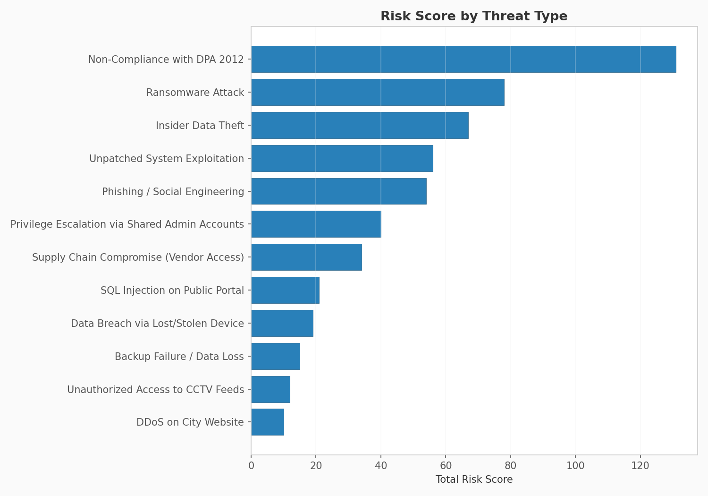
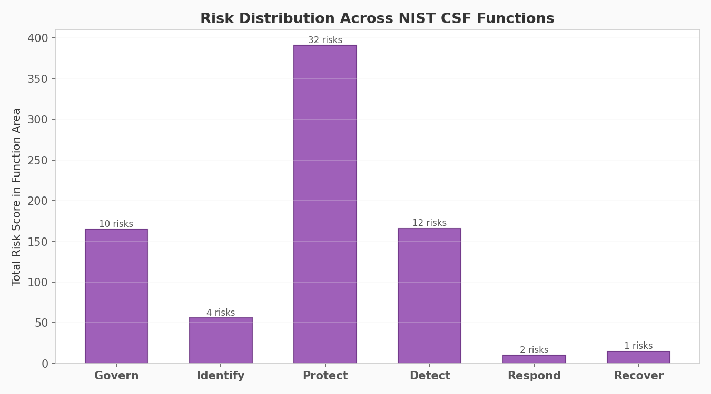
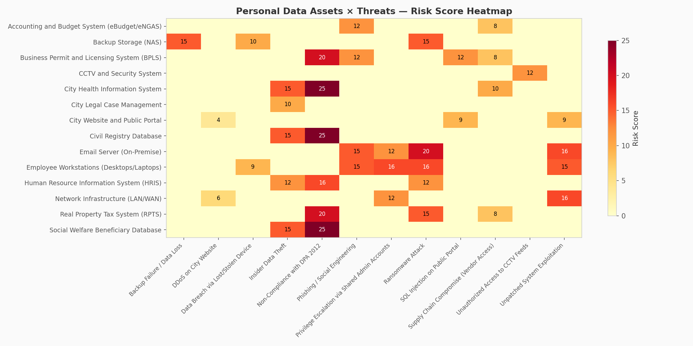
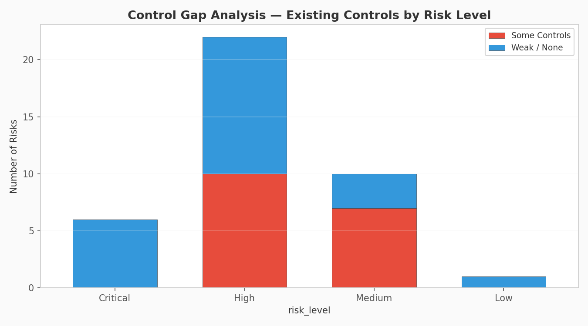

# 🛡️ Cybersecurity Risk Assessment for Philippine Local Government Units
### `[Applied]` — Cybersecurity, Governance & Compliance

<p align="center">
  
</p>

---

## 📋 Overview

This project builds a **complete cybersecurity risk assessment** for a Philippine Component City — the kind of deliverable a CISO, MIS Division head, or cybersecurity consultant would produce for a local government unit (LGU) that has never undergone a formal security review.

The assessment covers **15 information assets** across **11 city departments**, evaluates **12 threat scenarios**, and produces a **39-item risk register** scored on a 5×5 likelihood-impact matrix. It maps findings to the **NIST Cybersecurity Framework (CSF) 2.0** and flags compliance gaps under the **Philippine Data Privacy Act of 2012 (RA 10173)**.

**Why this matters — and why I built it:** As a former City Attorney and BAC Technical Working Group member, I worked alongside MIS Divisions and department heads in exactly this environment. Most Philippine LGUs have no Data Protection Officer, no incident response plan, and no documented risk register. This project is both a portfolio piece and a template that could actually be deployed.

---

## 🎯 Objectives

- Model a realistic LGU information asset inventory (RPTS, BPLS, Civil Registry, HRIS, etc.)
- Design threat scenarios relevant to Philippine government IT environments
- Score risks using a standard **5×5 likelihood × impact matrix**
- Map all risks to **NIST CSF 2.0** functions (Govern, Identify, Protect, Detect, Respond, Recover)
- Identify **Data Privacy Act (RA 10173)** compliance gaps
- Produce prioritized, actionable recommendations with implementation timelines
- Generate seven visualizations and an executive summary for city leadership

---

## 🏗️ Scenario: A Philippine Component City

```
City Profile (Simulated)
─────────────────────────────────────────
  Type             : Component City (3rd–4th income class)
  Employees        : ~200 across 11 departments
  IT Staff         : 2–3 in MIS Division (no dedicated security)
  Infrastructure   : On-premise servers, aging workstations
  Internet         : Single ISP, basic perimeter firewall
  Compliance       : Partial DPA 2012; no registered DPO
  Previous Audit   : None (cybersecurity)
```

### Departments Covered

| Department | Key System | Data Sensitivity |
|---|---|---|
| City Treasurer's Office | Real Property Tax System (RPTS) | Sensitive PI |
| Business Permits Office | Business Permit & Licensing (BPLS) | Personal Info |
| City Civil Registrar | Civil Registry Database | Sensitive PI |
| Human Resource Office | HRIS / 201 Files | Sensitive PI |
| BAC Secretariat | Procurement Records | Confidential |
| City Legal Office | Case Management System | Privileged |
| City Health Office | Health Information System | Sensitive PI |
| City Social Welfare | Beneficiary Database | Sensitive PI |
| City Accounting | eBudget / eNGAS | Confidential |
| MIS Division | Email, Network, Backups | Mixed |
| General Services | CCTV System | Personal Info |

---

## 📊 Visualizations

### 1. Risk Matrix (5×5)
All 39 risks plotted on a likelihood-impact grid. The upper-right quadrant (red zone) holds 6 critical risks — all DPA compliance or ransomware related.


### 2. Risk Level Distribution
Over 70% of identified risks are rated High or Critical — reflecting the near-total absence of formal security controls in most LGU environments.



### 3. Risk Exposure by Department
MIS Division carries the highest cumulative risk score — unsurprisingly, since it owns shared infrastructure serving all departments.



### 4. Risk by Threat Type
DPA non-compliance is the single highest-scoring threat — a regulatory risk, not a technical one, but one that carries real penalties under Philippine law.



### 5. NIST CSF Function Coverage
Most risks concentrate in the **Protect** function — indicating that basic preventive controls (patching, access management, encryption) are the primary gap.



### 6. Personal Data Heatmap
Assets containing sensitive personal information mapped against every applicable threat. The darkest cells represent the highest-priority remediation targets.



### 7. Control Gap Analysis
The majority of High and Critical risks have **weak or no existing controls** — confirming that the LGU's security posture is largely informal.



---

## 🔍 Key Findings

```
RISK SUMMARY
══════════════════════════════════════════════════════════════════
  Critical  :   6  (15.4%)   ← Require immediate action
  High      :  22  (56.4%)   ← Require short-term remediation
  Medium    :  10  (25.6%)
  Low       :   1  ( 2.6%)
  TOTAL     :  39

  Average risk score : 13.8 / 25
  Median risk score  : 15 / 25

TOP 3 CRITICAL RISKS
  [R029] DPA Non-Compliance — Civil Registry (Score: 25/25)
  [R031] DPA Non-Compliance — Social Welfare DB (Score: 25/25)
  [R032] DPA Non-Compliance — Health Info System (Score: 25/25)
```

---

## ✅ Recommendations

| Timeline | Action | Framework Ref |
|---|---|---|
| **0-30 days** | Appoint a Data Protection Officer (DPO) and register with NPC | DPA 2012 §24 |
| **0-30 days** | Deploy email filtering; run phishing simulation | NIST CSF PR.AT |
| **0-30 days** | Change all default credentials on CCTV and network devices | NIST CSF PR.AC |
| **30-90 days** | Deploy managed endpoint protection across all workstations | NIST CSF PR.PT |
| **30-90 days** | Establish monthly patch management schedule | NIST CSF PR.IP |
| **30-90 days** | Create offsite backup for critical databases | NIST CSF RC.RP |
| **90-180 days** | Draft Cybersecurity Policy via Sanggunian ordinance | NIST CSF GV.PO |
| **90-180 days** | Conduct Privacy Impact Assessments (PIA) | NPC Circular 2017-01 |
| **90-180 days** | Implement network segmentation for critical systems | NIST CSF PR.AC |
| **90-180 days** | Engage DICT for vulnerability assessment | NIST CSF ID.RA |

---

## 📜 Regulatory Framework

| Law / Standard | Relevance |
|---|---|
| **RA 10173** — Data Privacy Act of 2012 | Mandatory for all government agencies processing personal data |
| **NPC Circular 2016-01** | Security of Personal Data in Government |
| **NPC Circular 2017-01** | Privacy Impact Assessment guidelines |
| **NIST CSF 2.0** | International cybersecurity risk management framework |
| **ISO/IEC 27001:2022** | Information security management standard |
| **RA 9184** — Government Procurement Reform Act | BAC records and procurement data security |
| **DICT Memoranda** | National cybersecurity directives for government agencies |

---

## ⚙️ How to Run

```bash
cd cyber-govtech-portfolio/03-lgu-risk-assessment

# Install dependencies
pip install -r requirements.txt

# Generate asset inventory, threat scenarios, and risk register
python generate_lgu_risk_data.py

# Run the risk analysis
python analyze_lgu_risks.py
```

**Output:**
- Console: full risk report with recommendations
- `output/`: seven PNG charts + executive summary text file
- `data/`: three CSV files (assets, threats, risk register)

---

## 📁 Project Structure

```
03-lgu-risk-assessment/
├── README.md
├── requirements.txt
├── generate_lgu_risk_data.py           # Builds asset inventory, threats & risk register
├── analyze_lgu_risks.py                # Risk analysis engine + 7 charts
├── data/
│   ├── lgu_asset_inventory.csv         # 15 LGU information assets
│   ├── lgu_threat_scenarios.csv        # 12 threat scenarios (NIST-mapped)
│   └── lgu_risk_register.csv           # 39 scored risks
└── output/
    ├── 01_risk_matrix.png
    ├── 02_risk_distribution.png
    ├── 03_department_risk.png
    ├── 04_threat_breakdown.png
    ├── 05_nist_csf_coverage.png
    ├── 06_dpa_heatmap.png
    ├── 07_controls_gap.png
    └── executive_summary.txt
```

---

## 🧠 Skills Demonstrated

- **Cybersecurity**: Risk assessment methodology, threat modeling, NIST CSF mapping
- **Compliance**: Data Privacy Act (RA 10173), NPC Circulars, ISO 27001 awareness
- **Python**: Pandas, Matplotlib, NumPy, CSV processing
- **Data modeling**: Asset-threat-risk relational structure
- **Policy communication**: Executive summary, prioritized recommendations, regulatory references
- **Domain expertise**: Philippine LGU operations, BAC procurement, public sector IT

---

## 🔮 Future Improvements

- [ ] Build interactive risk register dashboard with Streamlit
- [ ] Add risk treatment tracking (accept, mitigate, transfer, avoid)
- [ ] Map threats to MITRE ATT&CK techniques
- [ ] Generate PDF risk assessment report using ReportLab
- [ ] Add cost-benefit analysis for recommended controls
- [ ] Compare LGU risk profile against DICT baseline maturity model
- [ ] Create reusable template that other LGUs can fork and adapt

---

## 📜 License

This project is for educational and portfolio purposes. The LGU scenario is entirely simulated — no real government data is used. The risk assessment methodology is based on publicly available frameworks (NIST CSF, ISO 27001) and Philippine laws (RA 10173, RA 9184).

---

*Part of the [Cybersecurity & Data Analytics Portfolio](https://github.com/[your-username]/cyber-govtech-portfolio) — built to demonstrate technical capability to NZ-based tech employers.*
