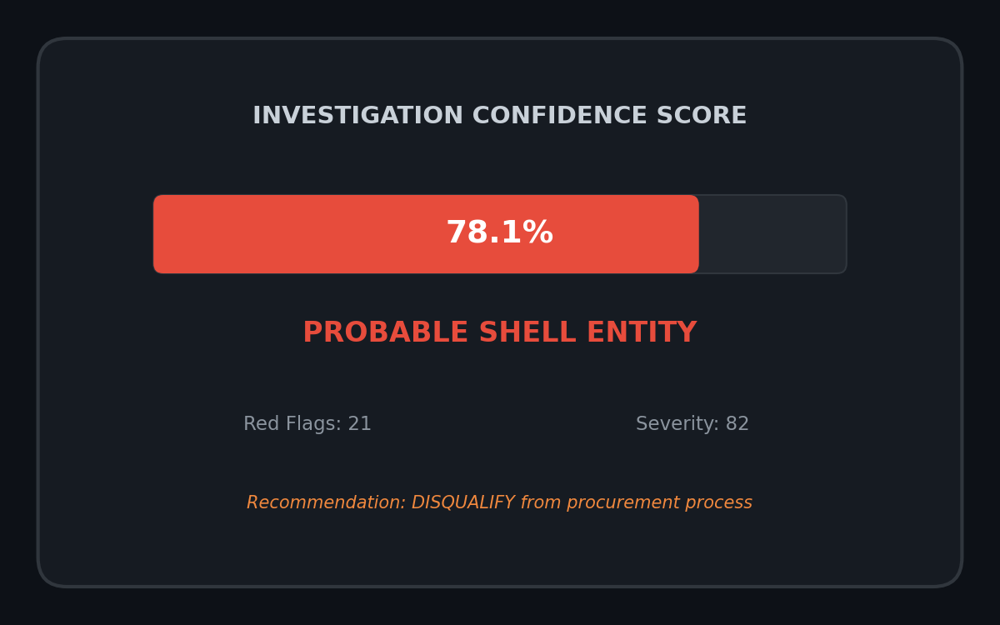
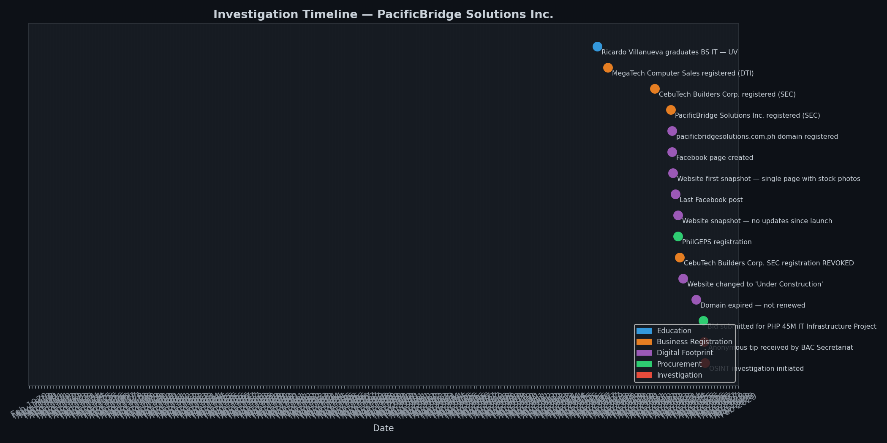
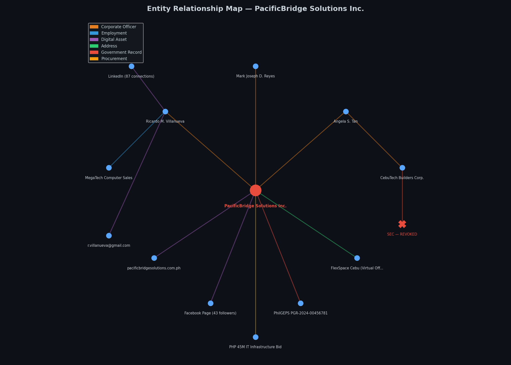
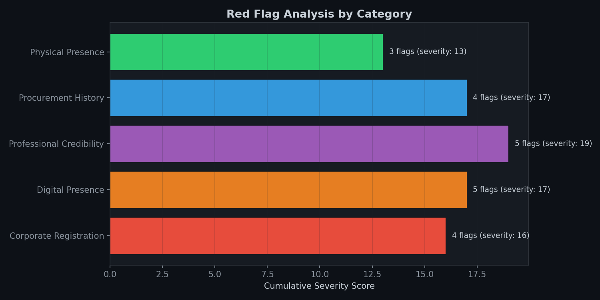
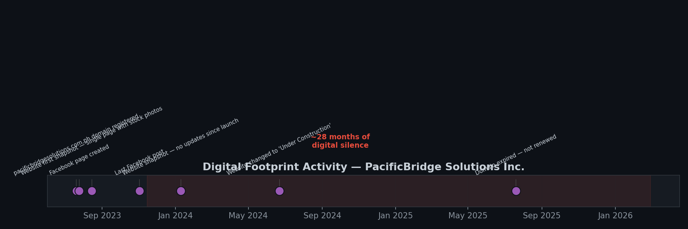

# 🔍 OSINT Investigation Walkthrough — Procurement Fraud Detection
### `[Intermediate]` — Cybersecurity, OSINT & Governance

<p align="center">
  
</p>

---

## 📋 Overview

This project is a **CTF-style OSINT (Open Source Intelligence) walkthrough** structured around a realistic scenario: an anonymous tip triggers an investigation into a suspicious government contractor bidding on a PHP 45M IT infrastructure project for a Philippine local government unit.

The investigation works through **seven OSINT artifacts** — SEC records, WHOIS data, web archives, social media footprints, PhilGEPS procurement records, physical address verification, and entity cross-referencing — to determine whether "PacificBridge Solutions Inc." is a legitimate company or a shell entity.

**All data is entirely fictitious.** No real persons, companies, or government records are referenced. The scenario is constructed to demonstrate OSINT methodology, not to accuse anyone.

**Why I built this:** In my years as a City Attorney sitting in BAC technical working groups, I saw bids from companies that existed only on paper. The due diligence process was manual and inconsistent. This project shows how structured OSINT can be systematized as a procurement integrity tool — and demonstrates investigative skills valued in cybersecurity, compliance, and fraud analytics roles.

---

## 🎯 The Scenario

```
CASE BRIEF
──────────────────────────────────────────────────────────
  Subject       : PacificBridge Solutions Inc.
  SEC Reg.      : CS-2023-07812
  Context       : Bidder on PHP 45M IT Infrastructure Project
  Trigger       : Anonymous tip received by BAC Secretariat
  Allegation    : Shell entity with fabricated credentials
  Methodology   : Open Source Intelligence (OSINT)
  Finding       : PROBABLE SHELL ENTITY (78.1% confidence)
──────────────────────────────────────────────────────────
```

---

## 🗂️ OSINT Artifacts Analyzed

| # | Artifact | Source Type | Key Finding |
|---|---|---|---|
| 1 | **SEC Registration** | Government DB | Incorporated 10 months before bid; paid-up capital 3% of project value |
| 2 | **WHOIS Lookup** | Public Registry | Domain registered to personal Gmail; now expired |
| 3 | **Web Archive** | Wayback Machine | Single-page website with stock photos; no portfolio |
| 4 | **Social Media** | LinkedIn, Facebook | CEO's prior role was retail sales; 43 FB followers, dormant |
| 5 | **PhilGEPS** | Government DB | Zero bid history; zero awards; Micro enterprise |
| 6 | **Address Verification** | Geospatial | Virtual office (PHP 2,500/month); no signage |
| 7 | **Entity Cross-Reference** | Multi-source | Co-incorporator linked to SEC-revoked company |

---

## 📊 Visualizations

### 1. Investigation Timeline
Chronological reconstruction of all events — from the CEO's graduation to the OSINT investigation.



### 2. Entity Relationship Map
Network diagram connecting the subject company to individuals, related entities, digital assets, and government records. The "SEC — REVOKED" node links co-incorporator Angela Tan to a previously dissolved company.



### 3. Red Flag Severity by Category
21 red flags scored across five categories. Procurement history and corporate registration carry the highest severity.



### 4. Digital Footprint Activity
The company's entire digital presence fits within a few months in 2023, followed by 28 months of silence — then a PHP 45M bid appears.



### 5. Investigation Confidence Scorecard
Weighted red flag analysis produces a 78.1% confidence score that the entity is a shell company.


---

## 🔍 Key Findings

```
RED FLAG SUMMARY — 21 FLAGS ACROSS 7 SOURCES
══════════════════════════════════════════════════════════════════

  [Corporate Registration]  (4 flags, severity: 16)
    ●●●●○  Company registered only 10 months before bid
    ●●●●●  Paid-up capital far below project value
    ●●○○○  Minimum incorporators (3 — legal floor)
    ●●●●●  Co-incorporator linked to revoked company

  [Digital Presence]  (5 flags, severity: 17)
    ●●●○○  Domain registered on personal Gmail
    ●●●●○  Domain expired and not renewed
    ●●●○○  Website used stock photos only
    ●●●●○  No project portfolio shown
    ●●●○○  Website went Under Construction

  [Professional Credibility]  (5 flags, severity: 19)
    ●●●●●  CEO's prior role was retail computer sales
    ●●●○○  No LinkedIn company page
    ●●●●○  Zero employee profiles on any platform
    ●●●●○  No professional certifications
    ●●●○○  43 Facebook followers, inactive since 2023

  [Procurement History]  (4 flags, severity: 17)
    ●●●●●  Zero prior bids in PhilGEPS
    ●●●●●  Zero government contract awards
    ●●●●●  Micro enterprise bidding on PHP 45M project
    ●●○○○  PhilGEPS registered 7 months after incorporation

  [Physical Presence]  (3 flags, severity: 13)
    ●●●●●  Registered address is a virtual office
    ●●●●○  No signage at registered address
    ●●●●○  Building reception has no record of company

  CONFIDENCE: 78.1% — PROBABLE SHELL ENTITY
```

---

## ✅ Recommended Actions

| # | Action | Legal Basis |
|---|---|---|
| 1 | Issue Notice of Disqualification | RA 9184 IRR, Section 23.1(b) |
| 2 | Refer to City Legal Office for possible criminal liability | RA 3019, RA 9184 Section 65 |
| 3 | Forward to PhilGEPS for blacklisting proceedings | PhilGEPS blacklisting rules |
| 4 | Adopt OSINT due diligence as BAC standard procedure | BAC policy recommendation |

---

## 🛠️ OSINT Methodology Demonstrated

```
  ┌─────────────┐
  │  1. DEFINE   │  Identify subject entity, define scope
  │  the target  │  and investigation questions
  └──────┬──────┘
         │
  ┌──────▼──────┐
  │  2. COLLECT  │  Gather artifacts from public sources
  │  artifacts   │  (SEC, WHOIS, archives, social, PhilGEPS)
  └──────┬──────┘
         │
  ┌──────▼──────┐
  │  3. ANALYZE  │  Cross-reference, identify red flags,
  │  & correlate │  map entity relationships
  └──────┬──────┘
         │
  ┌──────▼──────┐
  │  4. ASSESS   │  Score confidence, weight severity,
  │  confidence  │  determine finding
  └──────┬──────┘
         │
  ┌──────▼──────┐
  │  5. REPORT   │  Produce investigation report with
  │  & recommend │  evidence, visualizations, actions
  └─────────────┘
```

---

## ⚙️ How to Run

```bash
cd cyber-govtech-portfolio/04-osint-investigation

pip install -r requirements.txt

# Generate simulated OSINT artifacts
python generate_osint_artifacts.py

# Run the investigation analysis
python analyze_osint.py
```

**Output:**
- Console: full investigation report with findings and recommendations
- `data/`: 7 JSON artifacts + timeline CSV + entity network CSV
- `output/`: 5 visualizations

---

## 📁 Project Structure

```
04-osint-investigation/
├── README.md
├── requirements.txt
├── generate_osint_artifacts.py     # Simulated OSINT data (7 artifacts)
├── analyze_osint.py                # Investigation engine + 5 charts
├── data/
│   ├── artifact_01_sec_registration.json
│   ├── artifact_02_whois.json
│   ├── artifact_03_wayback.json
│   ├── artifact_04_social_media.json
│   ├── artifact_05_philgeps.json
│   ├── artifact_06_address.json
│   ├── artifact_07_entity_links.json
│   ├── osint_timeline.csv
│   └── entity_network.csv
└── output/
    ├── 01_investigation_timeline.png
    ├── 02_entity_network.png
    ├── 03_red_flag_severity.png
    ├── 04_digital_activity.png
    └── 05_confidence_scorecard.png
```

---

## 🧠 Skills Demonstrated

- **OSINT**: Structured open-source investigation across 7 intelligence sources
- **Python**: JSON processing, Pandas, Matplotlib, data correlation
- **Cybersecurity**: Digital footprint analysis, threat actor profiling
- **Legal reasoning**: Procurement law (RA 9184), anti-graft (RA 3019), DPA 2012
- **Visualisation**: Entity network diagram, investigation timeline, confidence scoring
- **Domain expertise**: Philippine procurement (BAC/PhilGEPS), SEC, corporate law

---

## 🔮 Future Improvements

- [ ] Automate WHOIS and domain lookups with Python `whois` library
- [ ] Integrate Shodan API for IP/infrastructure reconnaissance
- [ ] Add Maltego-style entity graph using NetworkX
- [ ] Build web scraper for PhilGEPS public bid notices
- [ ] Create Jupyter Notebook version for interactive walkthrough
- [ ] Add MITRE ATT&CK mapping for threat actor techniques

---

## ⚠️ Disclaimer

This project uses **entirely fictitious data**. No real companies, individuals, or government records are referenced. The scenario is designed to demonstrate OSINT methodology for educational and portfolio purposes only. The author does not endorse conducting unauthorized investigations on real entities.

---

*Part of the [Cybersecurity & Data Analytics Portfolio](https://github.com/[your-username]/cyber-govtech-portfolio) — built to demonstrate technical capability to NZ-based tech employers.*
