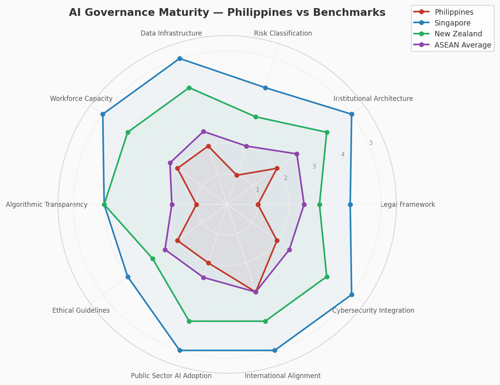
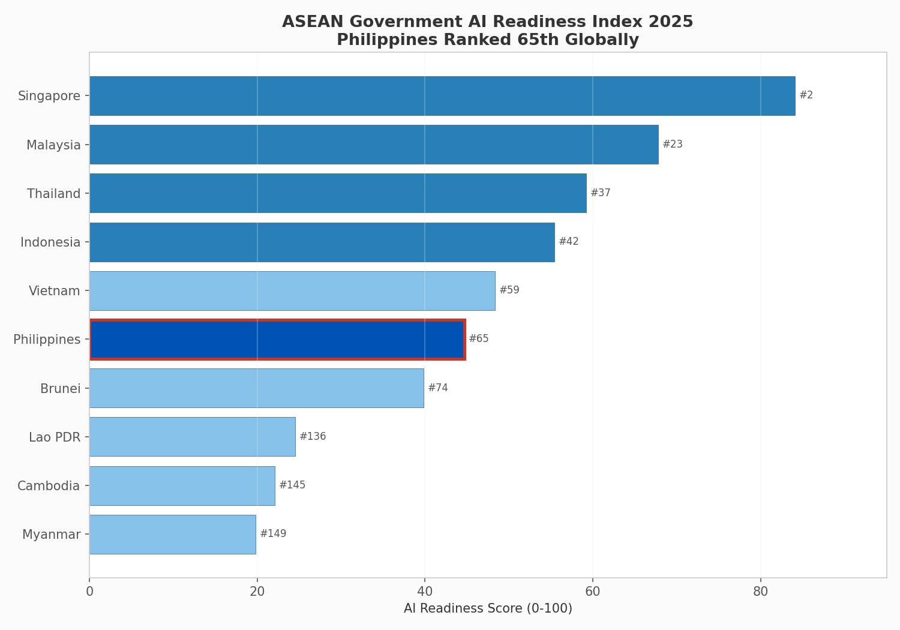
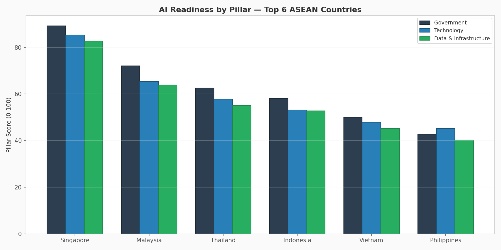
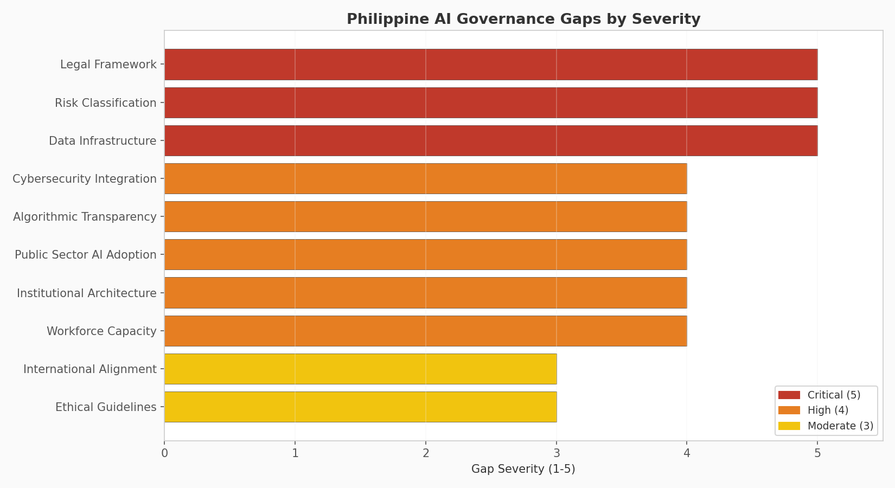
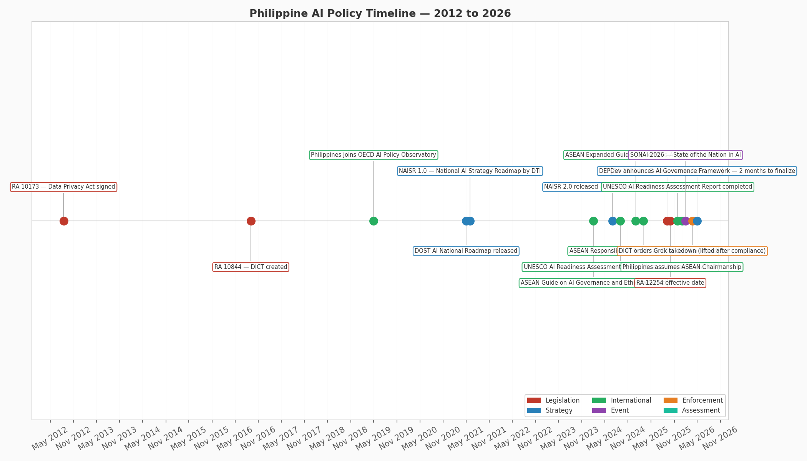
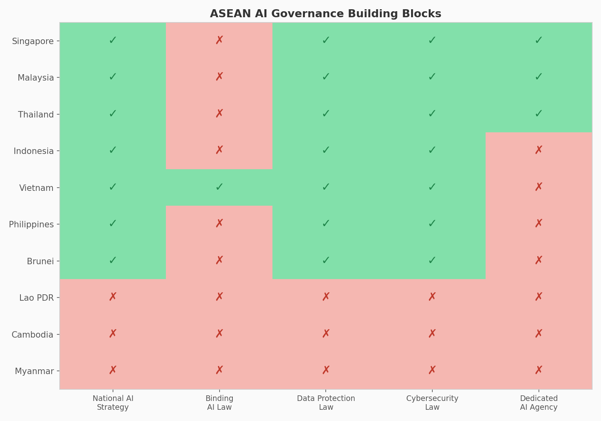
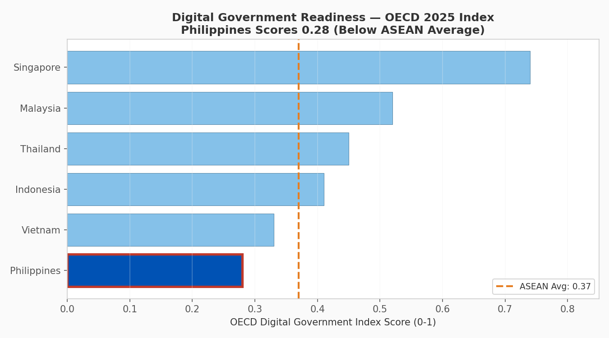

# 🏛️ Policy Brief: AI Governance Frameworks for the Philippines
### `[Applied]` — Policy Analysis, Data Analytics & International Studies

<p align="center">
  
</p>

---

## 📋 Overview

This project produces a **data-driven policy brief** analyzing the Philippines' AI governance readiness against ASEAN peers, Asia-Pacific leaders, and global benchmarks. It identifies **10 governance gaps**, scores them by severity, and proposes a **phased policy roadmap** for Philippine AI governance — timed to the country's 2026 ASEAN Chairmanship.

The analysis draws on published data from the **Oxford Insights Government AI Readiness Index 2025**, the **OECD Digital Government Index 2025**, the **UNESCO AI Readiness Assessment (November 2025)**, and national AI strategies from across ASEAN. Current developments — including the DEPDev announcement at the 2026 National Innovation Day that the AI Governance Framework will be finalized within two months — are incorporated.

**Why this project matters:** The Philippines ranks 65th globally in AI readiness, scoring 0.28/1.0 on the OECD Digital Government Index (third lowest in ASEAN). As 2026 ASEAN Chair, the Philippines has both the opportunity and obligation to advance regional AI governance — but credible leadership requires domestic readiness. This brief is written for Philippine policymakers and legislative staff, with actionable recommendations tied to existing Philippine law and institutional structures.

---

## 🎯 Research Questions

1. Where does the Philippines stand in AI governance readiness relative to ASEAN and global benchmarks?
2. What are the specific governance gaps preventing effective AI adoption in the Philippine public sector?
3. What models from Singapore, Vietnam, New Zealand, and the EU offer transferable policy lessons?
4. How can the Philippines leverage its 2026 ASEAN Chair presidency to advance AI governance domestically and regionally?

---

## 📊 Visualizations

### 1. ASEAN AI Readiness Rankings
The Philippines ranks 6th out of 10 ASEAN member states, with a readiness score of 44.7/100.



### 2. Readiness Pillars — Top 6 ASEAN
The Philippines' weakest pillar is Data & Infrastructure (40.3), reflecting fragmented government data systems.



### 3. Governance Gap Severity
Three dimensions score maximum severity (5/5): Legal Framework, Risk Classification, and Data Infrastructure.



### 4. Governance Maturity Radar — Philippines vs Benchmarks
The Philippines (red) sits well inside Singapore (blue), New Zealand (green), and even the ASEAN average (purple) on every dimension.


### 5. Philippine AI Policy Timeline (2012–2026)
A 14-year timeline showing the accumulation of strategies, legislation, and international commitments — and the gap between policy declarations and binding governance.



### 6. ASEAN Regulatory Building Blocks
Only Vietnam has enacted binding AI legislation. The Philippines has foundational laws (DPA, Cybercrime Act) but no AI-specific legal framework or dedicated agency.



### 7. OECD Digital Government Index
The Philippines scores 0.28/1.0 — below the ASEAN average of 0.37 and far behind Singapore's 0.74.



---

## 🔍 Key Findings

```
PHILIPPINE AI GOVERNANCE — HEADLINE METRICS
══════════════════════════════════════════════════════════════════
  Global AI Readiness Rank      : 65th / 193 countries
  Readiness Score               : 44.7 / 100
  OECD Digital Government Score : 0.28 / 1.0 (ASEAN avg: 0.37)
  Governance Maturity (avg)     : 1.8 / 5.0
  Gap from Singapore            : 39.4 points
  Gap from ASEAN average        : below average in 8/10 dimensions
  Binding AI legislation        : None
  Dedicated AI authority        : None

TOP 3 CRITICAL GAPS (Severity 5/5)
  ●●●●●  Legal Framework — no binding AI law
  ●●●●●  Risk Classification — no risk tiering system
  ●●●●●  Data Infrastructure — fragmented, no national data strategy
```

---

## ✅ Policy Recommendations (Phased)

| Phase | Timeline | Recommendations |
|---|---|---|
| **Phase 1** | 2026 (Immediate) | Finalize DEPDev AI Framework; designate coordinating authority; EO requiring agency AI inventory |
| **Phase 2** | 2026–2027 | Draft Philippine AI Governance Act (risk-based); Philippine Data Strategy; Algorithm Charter; CSC AI literacy |
| **Phase 3** | 2027–2028 | AI Ethics Board; procurement guidelines for AI under RA 9184; amend RA 10175 for AI threats |

---

## 🌏 Comparative Models Referenced

| Country / Framework | Transferable Lesson |
|---|---|
| **Singapore** (Model AI Governance Framework) | Voluntary-first approach that achieved industry adoption before legislation |
| **Vietnam** (AI Law No. 134/2025) | First binding AI law in ASEAN — risk-based model |
| **EU** (AI Act 2024) | Tiered risk classification applicable to Philippine adaptation |
| **New Zealand** (Algorithm Charter) | Transparency norm for government AI without binding legislation |
| **ASEAN Guide** (2024, expanded 2025) | Regional alignment framework the Philippines helped adopt |
| **Thailand** (draft AI Act) | Risk-based royal decree with prohibited-use categories |

---

## 🇵🇭 The ASEAN Chair Opportunity

The Philippines assumed the ASEAN Chairmanship on 1 January 2026 under the theme "Navigating Our Future Together." This policy brief argues that the presidency provides a unique window to:

- Champion the **ASEAN Responsible AI Roadmap 2025-2030**
- Propose **harmonized AI risk classification** across ASEAN
- Host an **ASEAN AI Governance Summit** in the Philippines
- Demonstrate **domestic implementation** as a credibility signal

Regional leadership without domestic readiness produces declarations without implementation.

---

## ⚙️ How to Run

```bash
cd cyber-govtech-portfolio/05-ai-governance-policy-brief

pip install -r requirements.txt

# Generate comparative datasets
python generate_ai_governance_data.py

# Run the analysis and generate policy brief
python analyze_ai_governance.py
```

**Output:**
- Console: full comparative analysis with maturity scoring
- `output/`: 7 charts + policy brief text file
- `data/`: 4 CSV datasets

---

## 📁 Project Structure

```
05-ai-governance-policy-brief/
├── README.md
├── requirements.txt
├── generate_ai_governance_data.py      # Comparative governance datasets
├── analyze_ai_governance.py            # Analysis engine + 7 charts + brief
├── data/
│   ├── asean_ai_readiness.csv          # 10 ASEAN countries, multi-pillar
│   ├── ph_governance_gaps.csv          # 10 governance dimensions
│   ├── ph_ai_timeline.csv             # 17 policy milestones (2012–2026)
│   └── policy_dimensions.csv           # 5-way comparison scoring
└── output/
    ├── 01_asean_readiness.png
    ├── 02_readiness_pillars.png
    ├── 03_gap_severity.png
    ├── 04_radar_comparison.png
    ├── 05_policy_timeline.png
    ├── 06_regulatory_matrix.png
    ├── 07_oecd_digital_govt.png
    └── policy_brief.txt
```

---

## 📚 Data Sources

| Source | Detail |
|---|---|
| Oxford Insights | Government AI Readiness Index 2025 |
| OECD | Digital Government Index 2025 |
| UNESCO | AI Readiness Assessment — Philippines (Nov 2025) |
| ASEAN Secretariat | Guide on AI Governance and Ethics (2024); Expanded Gen AI Guide (2025) |
| DTI Philippines | National AI Strategy Roadmap (NAISR) 2.0 (July 2024) |
| DOST Philippines | AI National Roadmap (2021); Philippine AI Program Framework |
| DEPDev Philippines | 2026 National Innovation Day announcement (April 2026) |
| DICT Philippines | SONAI 2026 proceedings; Grok takedown order (March 2026) |
| Philippine Congress | RA 10173 (DPA); RA 12254 (E-Governance Act); RA 10175 (Cybercrime) |
| NZ Government | Algorithm Charter for Aotearoa New Zealand |

---

## 🧠 Skills Demonstrated

- **Policy analysis**: Comparative governance, gap assessment, phased recommendations
- **Data analytics**: Python, Pandas, Matplotlib, radar charts, comparative matrices
- **International studies**: ASEAN governance, cross-jurisdictional comparison
- **Legal knowledge**: Philippine legislation (RA 10173, RA 12254, RA 9184, RA 10175)
- **Research methodology**: Multi-source data synthesis from government publications
- **Communication**: Policy brief written for decision-makers, not technicians

---

## 🔮 Future Improvements

- [ ] Add sentiment analysis of Philippine congressional AI-related bills
- [ ] Build interactive Streamlit dashboard for governance comparison
- [ ] Incorporate OECD AI Policy Observatory data via API
- [ ] Track implementation of DEPDev framework post-finalization
- [ ] Add cost estimation for recommended institutional reforms
- [ ] Expand comparison to include Philippines vs Pacific Island states

---

## ⚠️ Disclaimer

This policy brief is produced for academic and portfolio purposes as part of a Master's thesis at the Institute Pacific, New Zealand. All data is derived from publicly available government publications and international indices. The recommendations reflect the author's analysis and do not represent the positions of any government agency.

---

*Part of the [Cybersecurity & Data Analytics Portfolio](https://github.com/[your-username]/cyber-govtech-portfolio) — built to demonstrate technical capability to NZ-based tech employers.*
